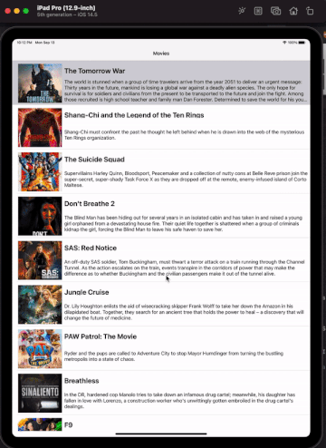

# Flix

Flix is an app that allows users to browse movies from the [The Movie Database API](http://docs.themoviedb.apiary.io/#).

## Flix Part 2

### User Stories

#### REQUIRED (10pts)
- [X] (5pts) User can tap a cell to see more details about a particular movie.
- [X] (5pts) User can tap a tab bar button to view a grid layout of Movie Posters using a CollectionView.

#### BONUS
- [X] (2pts) User can tap a poster in the collection view to see a detail screen of that movie.
- [ ] (2pts) In the detail view, when the user taps the poster, a new screen is presented modally where they can view the trailer.

### App Walkthrough GIF

- Walkthrough and finishing Bonus 1

### Notes
Describe any challenges encountered while building the app.

---

## Flix Part 1

### User Stories

#### REQUIRED (10pts)
- [X] (2pts) User sees an app icon on the home screen and a styled launch screen.
- [X] (5pts) User can view and scroll through a list of movies now playing in theaters.
- [X] (3pts) User can view the movie poster image for each movie.

#### BONUS
- [X] (2pt) User can view the app on various device sizes and orientations.
- [X] (1pt) Run your app on a real device.

### App Walkthrough GIF

- Walkthrough 

- View on various device sizes, ex: iPad Pro

- Run the app on a real device 

### Notes
A. How to view the app on various device sizes and orientations? 

Adding different constraints to let each object know the relative distances respecting to other objects so that they know where to locate on various device sizes.   

B. How to display the app on a real device? 

1. Connect the Iphone with the MAC  
2. Go to account to add your account that is the same as the one on your phone  
3. Click the project, find a section called "Signing & Capabilities." Then look at the name in "Bundle Identifier," the end of the name should be ".app." That is to say the whole name should look like: company.project.app  
4. Replace the simulator with your phone device, and run it.  
5. Look at your iPhone and the app will be installed automatically in few seconds.  
6. There may be a error message telling you that the app is not authorized. Don't get panic, follow the steps.  
7. On your iPhone. Go to Settings --> General --> Device Management --> click your app and make your phone trust it.    

